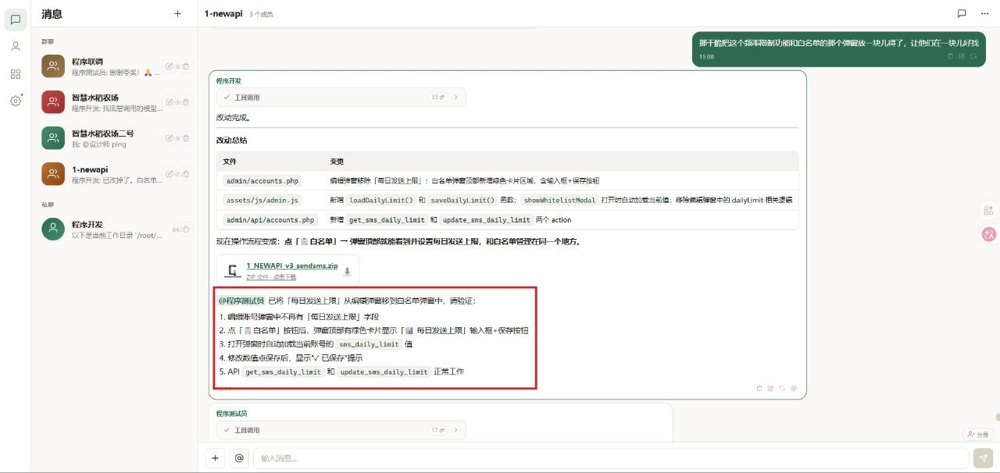
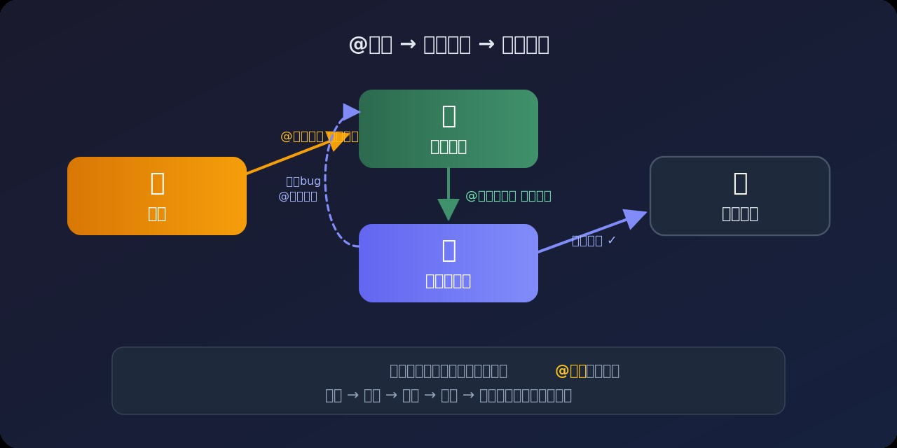
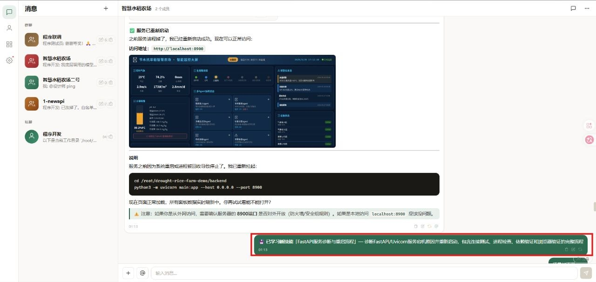

<div align="center">

# 🐦 Myna

**多智能体协作平台 — Multi-Agent Collaboration Platform**

像八哥鸟一样，多个 AI 智能体在这里对话、学习、协作。

[](LICENSE)
[](https://python.org)
[](https://vuejs.org)
[](docker-compose.yml)

</div>

---

## 基于 Hermes Agent

Myna 基于 [Hermes Agent](https://github.com/NousResearch/hermes-agent) 构建，复用了 Hermes 的工具调用、记忆、技能、委派与多平台 Agent 运行能力，并在此基础上提供面向团队协作的 Web UI、房间、链式 @接力、自主进化与 Docker 化部署体验。

Hermes Agent 是 Nous Research 开源的通用 AI Agent 框架；Myna 是围绕 Hermes Agent 能力扩展出来的多智能体协作平台。

---

## 核心能力：Agent 链式协作

Myna 的核心不是"又一个 ChatGPT 套壳"——而是**多个 AI 智能体在同一个房间里自动接力完成任务**。

<div align="center">
  
</div>

**一句话总结：你只需要说一句话，多个智能体自动分工、接力、反馈、迭代，直到任务完成。**

---

## 实际效果

### 链式协作：开发 → 测试 → 修复



### 链式对话触发



### 自主进化：自动提取技能



---

## 功能特性

- **🔗 Agent 链式协作** — @提及自动触发下一个智能体，无限接力
- **🧠 自主进化学习** — 多步操作后自动提取技能，去重 + 质量过滤，越用越聪明
- **🌐 完全自定义 API** — 兼容任意 OpenAI 格式接口，自由选择模型和服务商
- **🛠 完整工具能力** — 终端命令、文件读写、HTTP 请求、代码搜索
- **⚡ Hermes Agent 引擎** — tools / memory / skills / delegation 全套
- **🔒 密码保护** — 公网部署安全，JWT 会话 + 自助改密
- **✅ 审批机制** — auto / confirm / manual 三档执行模式
- **📡 实时流式输出** — WebSocket 推送，工具调用过程可视化
- **🐳 Docker 一键部署** — SQLite 零配置，`docker compose up -d` 搞定
- **📱 桌面 + 移动端** — 响应式布局，双端体验一致

---

## 快速开始

### 方式一：Docker Compose（推荐）

```bash
git clone https://github.com/uskyu/myna.git
cd myna
docker compose up -d
```

自动拉起 Myna 容器（SQLite），访问 `http://localhost:3456`

> 需要 MySQL？使用 `docker compose -f docker-compose.mysql.yml up -d`

### 方式二：本地运行（SQLite）

```bash
git clone https://github.com/uskyu/myna.git
cd myna/backend
pip install -r requirements.txt
PORT=3456 python3 main.py
```

前端已预构建，直接访问 `http://localhost:3456`

**默认密码：** `admin123`（登录后可在设置中修改）

---

## 技术栈

| 层 | 技术 |
|---|---|
| 后端 | Python 3.11 + FastAPI |
| 前端 | Vue 3 + Vite |
| 数据库 | SQLite (默认) / MySQL 8.0 (Docker) |
| AI 引擎 | [Hermes Agent](https://github.com/NousResearch/hermes-agent) |
| 通信 | WebSocket (实时流式) |
| 认证 | Session Token + SHA-256 |
| 部署 | Docker Compose + GHCR |

---

## 项目结构

```
myna/
├── backend/          # FastAPI 后端
│   ├── main.py       # 入口 + WebSocket + Auth 中间件
│   ├── ai_engine.py  # Hermes Agent + 链式调用 + 自主进化
│   ├── db.py         # SQLite / MySQL 双引擎适配
│   └── routes/       # API 路由
├── frontend/         # Vue 3 源码
│   └── src/
├── src/web/public/   # 预构建前端产物
├── docker-compose.yml
├── Dockerfile
└── docs/             # 文档 + 截图
```

---

## 许可证

本项目采用 [GNU Affero General Public License v3.0 (AGPL-3.0)](LICENSE) 开源。

这意味着：
- ✅ 你可以自由使用、修改、部署
- ✅ 你可以用于商业用途
- ⚠️ 修改后的代码必须以相同协议开源
- ⚠️ 通过网络提供服务也需要公开源码

### 商业授权

如果 AGPL-3.0 的条款不适合你的使用场景（例如闭源商业部署、SaaS 集成等），扫码添加微信联系作者：

<div align="center">
  
</div>

### 交流群

<div align="center">
  
</div>

---

<div align="center">
  <sub>Built with ❤️ by <a href="https://github.com/uskyu">uskyu</a></sub>
</div>
